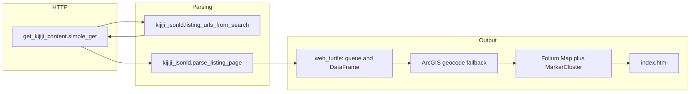

# Development document

This file summarizes how the **real_estate_map** repository is built and maintained as of **April 2026**. User-facing setup and commands live in the root [`README.md`](../README.md).

## Purpose

Scrape **Kijiji houses for sale** around **St. John’s, NL** (search URL baked into [`web_turtle.py`](../web_turtle.py)), enrich each listing, and emit a single **Folium** map as **`index.html`**.

A separate **[`reference/scraper.py`](../reference/scraper.py)** targets **rentals** and is not imported by the main pipeline; it is optional reference material and can be run with `uv sync --extra reference` (adds `loguru`).

## Tooling and dependencies

- **Python:** 3.11+ (`requires-python` in [`pyproject.toml`](../pyproject.toml)).
- **Package manager:** **uv** is the intended workflow: `uv sync` creates `.venv` and installs from **`uv.lock`**.
- **Direct runtime dependencies:** `beautifulsoup4`, `folium`, `geopy`, `pandas`, `requests` (see `pyproject.toml`).
- **Pip:** [`requirements.txt`](../requirements.txt) lists the same direct deps for non-uv installs.

## Architecture (main pipeline)

1. **Search pages** — For each page index `1 … MAX_PAGES`, build the St. John’s list URL, fetch HTML, and extract listing URLs from **`application/ld+json`** (`ItemList` / `itemListElement`). If that fails, fall back to `<a href>` links matching `/v-house-for-sale/` (and similar) with a numeric ad id.
2. **Detail pages** — For each listing URL, fetch HTML and parse the primary listing object from JSON-LD (e.g. `SingleFamilyResidence` with `offers`). Fields include title, description, price, address, bedrooms/bathrooms/size summary, and coordinates when present under **`offers.availableAtOrFrom`**.
3. **Coordinates** — Prefer JSON-LD; if lat/lon missing, **`geocode_missing_rows`** uses **ArcGIS** via `geopy` with a **bounded** number of passes so failed geocodes cannot loop forever.
4. **Data assembly** — Rows are queued then drained into parallel lists keyed like a `DataFrame`; **`clean_df`** drops duplicate **`address`** strings (multiple listings at one address may collapse).
5. **Map** — Rows with both coordinates are plotted; popup HTML uses **`%` formatting** with user text passed through **`%` escaping** so descriptions containing `%` do not crash the build. Marker colours follow price bands (including **`beige`** for the $300k–$400k band because Folium has no `yellow`).

## Key modules

| Module | Responsibility |
|--------|----------------|
| [`web_turtle.py`](../web_turtle.py) | CLI entry, pagination, scrape loop, geocode, Folium export |
| [`kijiji_jsonld.py`](../kijiji_jsonld.py) | JSON-LD discovery and listing/detail field extraction |
| [`get_kijiji_content.py`](../get_kijiji_content.py) | Shared `requests.Session`, browser-like headers, retries, 429 backoff |

## Configuration

Environment variables are read at import time in `web_turtle.py` via **`_env_int`** (invalid values log a message and fall back to defaults):

| Variable | Role |
|----------|------|
| `REAL_ESTATE_MAP_MAX_PAGES` | Number of search pages to scrape (code default if unset: **13** — verify in source if this doc drifts) |
| `REAL_ESTATE_MAP_MAX_LISTINGS_PER_PAGE` | Cap URLs per search page; **0** means no cap (useful for smoke tests) |

Politeness: a **delay** (default 2 seconds) sleeps between listing requests inside `web_scraper`.

## Historical note (parser modernization)

Older code relied on **hashed CSS module class names** and **`div.search-item`**, which break whenever Kijiji rebuilds the front end. The current approach prefers **structured data (JSON-LD)** with a **link-based fallback** on search pages, which is easier to keep working across site updates.

## Known issues and records

- **OSM tile 403 when opening `index.html` as `file://`** — Default Folium tiles use OpenStreetMap’s public servers; local file URLs often lack an acceptable **Referer**. Mitigations: HTTP server, GitHub Pages, or an alternate `tiles=` provider (e.g. CartoDB). See **[`DEVELOPMENT_RECORD_01.md`](DEVELOPMENT_RECORD_01.md)** for the full note.
- **README link:** If the root README still points at `DEVELOPMENT_RECORD.md`, use **`DEVELOPMENT_RECORD_01.md`** (or add a stub redirect file) so the link matches the repo.

## Outputs and artifacts

- **`index.html`** — Generated in the project root by `web_turtle.py` (not committed by default unless you choose to).
- **`.venv` / `uv.lock`** — Local environment and lockfile for reproducible installs.

## Suggested follow-ups (not implemented)

- Export CSV alongside the map for analysis.
- Deduplicate by **URL** as well as or instead of address.
- Optional CLI flags instead of only environment variables.
- Align `reference/scraper.py` pagination URL keys if that script is revived for production use.
